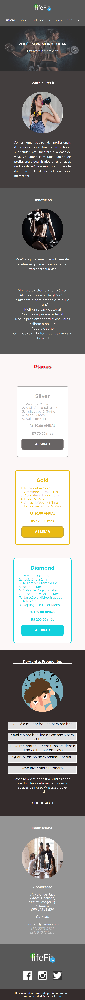

<h1 align="center"> lifeFit </h1>

  

## 🚀 Tecnologias

Esse projeto foi desenvolvido com as seguintes tecnologias:

- HTML e CSS
- Figma
- Git e Github
- Metodologia BEM
- first Mobile

## 💻 Projeto

O lifeFit é um projeto para pessoas que buscam ajuda em melhorar sua qualidade de vida e saúde tanto mental quanto fisíca, acessibilidade em todos os aparelhos além de utilizar técnicas de  arquitetura CSS fazendo uso da estrategia BEM(Block, Element , Modifier).

- [Acesse o projeto finalizado, online](https://ramonwordads.github.io/lifeFit)
